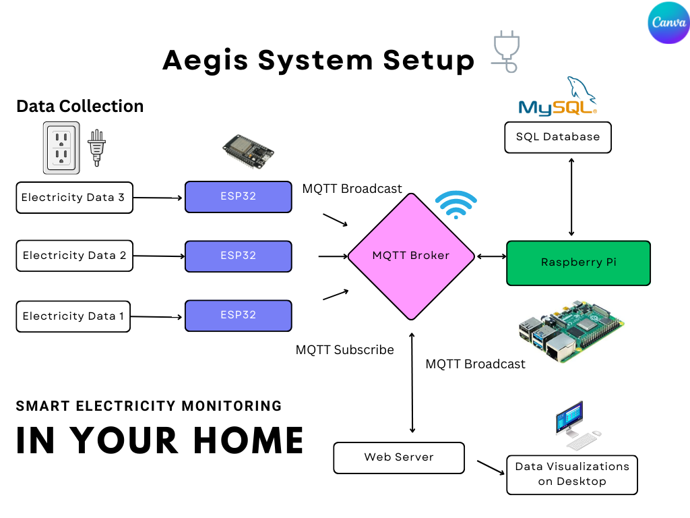
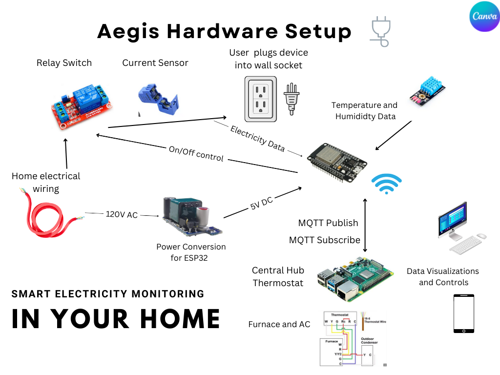

# Aegis
## An intelligent smart home solution to monitor and reduce your homes energy consumption.

### Get Started
Run the setup.py script to install all the dependencies, and create an python environment for the project.
```bash
python3 setup.py
```

### Authors:
- Emin Kirimlioglu
- Dominic Orlando
- Joshua Ball
- Kevin Shin

### About
> Aegis is a smart home thermostat that adjusts your houses temperature based on the electricity providers rates,
> outside temperature, solar panel production, and your personal preferences. Aegis also includes dongles that can be
> plugged into your appliances to monitor their energy consumption. Aegis will then use this information to optimize
> your energy consumption and save you money.

[Aegis](https://prezi.com/view/s4CaD95mIxlZDG96sGap)

### Diagrams 




```bash
.
├── README.md
├── Diagram1.png
├── Application
|   ├── Application.md
|   ├── Website
|   |   ├── Website.md
|   |   └── webServer.py
|   └── Mobile
|       └── Mobile.md
├── Dongle
|   ├── Dongle.md
|   ├── Solar
|   |    └── solar.cpp
|   └── Outlet
|        └── outlet.cpp
├── Market Research
|   ├── Interviews
|   └── Market Research.pdf
├── Thermostat
    ├── Thermostat.md
    └── piServer.py
```

### Installation

